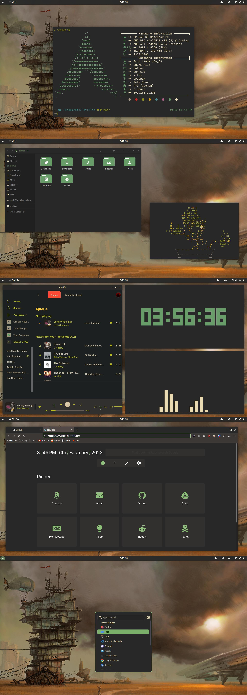
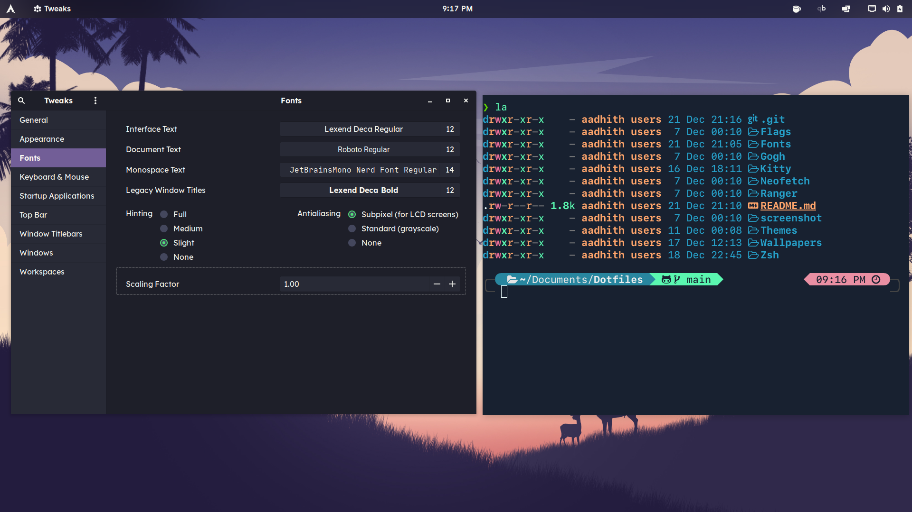

# Dotfiles

## Screenshots



## Zsh

1. ZSH shell ```sudo pacman -S zsh```

2. OH_MY_ZSH ```sh -c "$(curl -fsSL https://raw.github.com/ohmyzsh/ohmyzsh/master/tools/install.sh)"```

3. Powerlevel10k ```git clone https://github.com/romkatv/powerlevel10k.git $ZSH_CUSTOM/themes/powerlevel10k```

4. Exa ```sudo pacman -S exa```

#### Plugins

- zsh-autosuggestions ```git clone https://github.com/zsh-users/zsh-autosuggestions ${ZSH_CUSTOM:-~/.oh-my-zsh/custom}/plugins/zsh-autosuggestions```

- zsh-syntax-highlighting ```git clone https://github.com/zsh-users/zsh-syntax-highlighting.git ${ZSH_CUSTOM:-~/.oh-my-zsh/custom}/plugins/zsh-syntax-highlighting```

## Fonts

As we all know font rendering is pretty meh in Linux, These fonts seem to be working out pretty good for me.

- UI - Lexend Deca, Rubik, Ubuntu
- Terminal - Terminal font is usually a toss up between JetBrainsMono, Cascadia Code and Apple's SF Mono
- Documents - Roboto Regular


